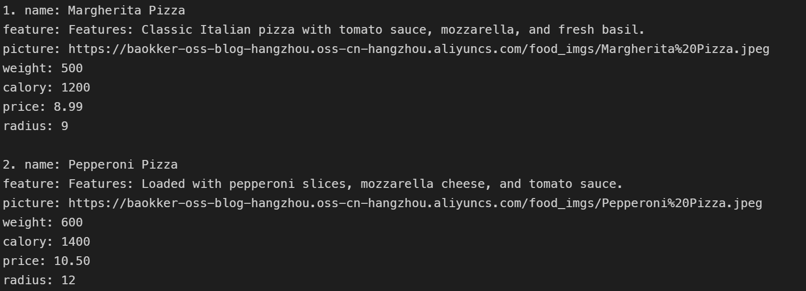
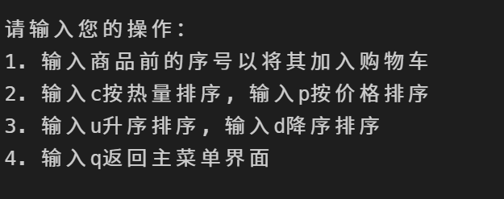
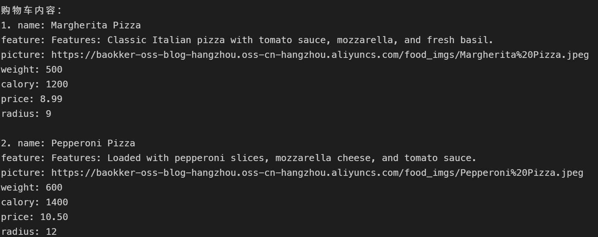
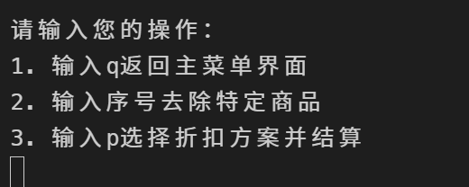
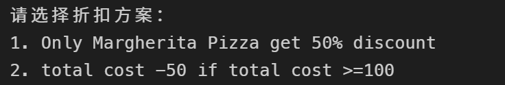
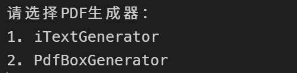

# 2024-java企业级开发小测 - 加菲猫餐厅系统

一个基于命令行的餐厅点餐与结算小系统，支持浏览菜品（披萨/薯条/炸鸡）、按热量/价格排序、加入购物车、选择折扣方案结算，并可使用 iText 或 PDFBox 导出结算单 PDF。

## 使用环境
- Java 21
- Maven 3.8.6

## 运行
确保安装了合适的java和maven版本并配置好环境后, 可使用code runner插件直接运行

## 目录结构
```
pom.xml
src/
	main/
		java/com/reisen/cw/
			Main.java                   # 程序入口
			Displayer.java              # 交互与展示逻辑
			Discount/                   # 折扣策略
			Food/                       # 食品模型与 HTML 解析
			PdfGenerator/               # PDF 生成器（iText、PDFBox）
		resources/
			food.html                   # 菜单数据（从 classpath 加载）
reports/                                            # PDF 输出目录
```

## 使用说明
- 主菜单：
	- 1 查看所有披萨
	- 2 查看所有薯条
	- 3 查看所有炸鸡
	- 4 查看购物车
	- 5 退出系统


- 列表页操作：
	- 输入商品序号：加入购物车
	- 输入 c/p：按热量/价格排序
	- 输入 u/d：升序/降序
	- 输入 q：返回主菜单





- 购物车页操作：
	- 输入序号：移除对应商品
	- 输入 p：选择折扣方案并结算
	- 输入 q：返回主菜单





- 折扣方案（示例）：
	- HalfPriceDiscount：仅玛格丽特披萨享五折
	- Minus50Discount：满一定条件减 50（示例策略）



- 结算后可选择 PDF 生成器导出账单：
	- iText 生成 `reports/iTextReport.pdf`
	- PDFBox 生成 `reports/PdfBoxReport.pdf`



## PDF 导出与字体说明
- iText：直接写入段落文本；若出现 SLF4J NOP 日志提示，可忽略（不影响功能）。
- PDFBox：默认尝试加载资源文件 `simkai.ttf`（楷体），系统已优化逐行写入，避免换行符与字体编码问题

## 数据来源与资源加载
- 菜单数据位于 `src/main/resources/food.html`，运行时通过 classpath 加载（`/food.html`）。

